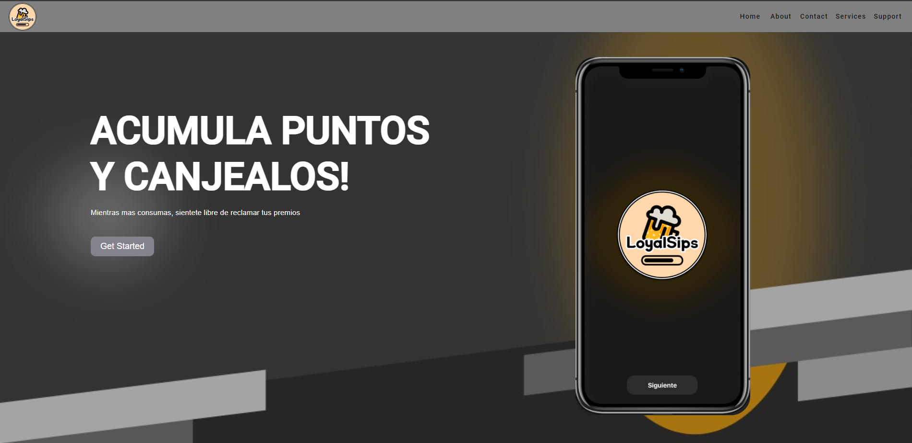

# TP1

## Project Description

El objetivo principal de este proyecto es desarrollar una aplicación que permita a los usuarios clientes de los bares,
la facilidad de ganar puntos por cada consumo realizado, los cuales podrán ser canjeados por productos o servicios que
el bar ofrezca. Del mismo modo, se tiene como objetivo ayudar al bar a controlar el inventario por medio de un sistema
de inventario que permita llevar un control de los productos que se tienen en stock, así como también, llevar un control
de los productos en stock, para evitar que se agoten y no se puedan ofrecer a los clientes.

## Development server

Run `ng serve` for a dev server. Navigate to `http://localhost:4200/`. The application will automatically reload if you change any of the source files.

## Code scaffolding

Run `ng generate component component-name` to generate a new component. You can also use `ng generate directive|pipe|service|class|guard|interface|enum|module`.

## Build

Run `ng build` to build the project. The build artifacts will be stored in the `dist/` directory.

## Running unit tests

Run `ng test` to execute the unit tests via [Karma](https://karma-runner.github.io).

## Running end-to-end tests

Run `ng e2e` to execute the end-to-end tests via a platform of your choice. To use this command, you need to first add a package that implements end-to-end testing capabilities.

## Further help

To get more help on the Angular CLI use `ng help` or go check out the [Angular CLI Overview and Command Reference](https://angular.io/cli) page.

